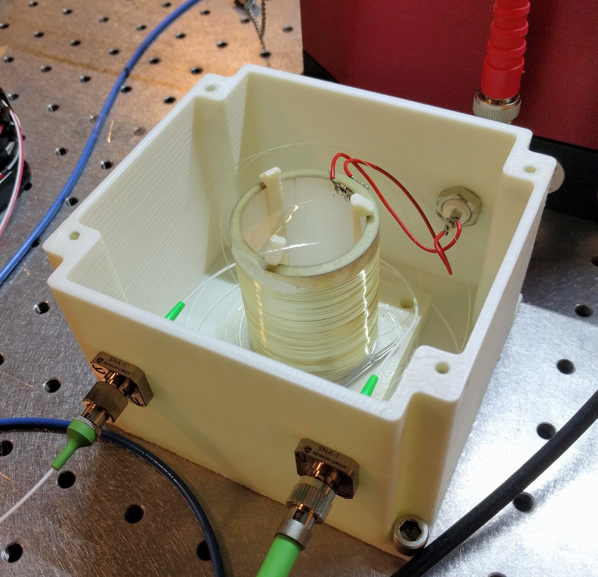

# FiberStretcher
3D-printed optical fiber stretcher for phase control of light. It can be used, for example, to lock the phase between two arms of an interferometer.

Example of an older version:

## Required equipment

* Tube piezoelectric actuator [such as this one](https://www.steminc.com/PZT/en/piezo-ceramic-cylinder-40x33x50mm-32-khz). Its diameter should be large enough to reduce bending losses to an acceptable level and its fundamental resonance frequency should be chosen in accordance to the desired bandwidth of the specific application where it will be used.
* Coated optical fiber such as [SMF28](https://www.corning.com/media/worldwide/coc/documents/Fiber/SMF-28%20Ultra.pdf) (no buffer layer or jacket) 
* Fiber mating sleeve ([example](https://www.thorlabs.com/thorproduct.cfm?partnumber=ADAFC3))
* Fiber patch cord
* Fiber splicer
* BNC connector
* Super glue
* Tape
* M3, M2 screws

## Instructions

* Hold down the starting end with tape. Leave enough length at the start so you can later splice it. Also, leave enough space on the cylinder so you can later solder electrical wires to it. 
* Wind the fiber around the piezo cylinder. Keep the fiber tense around the cyllinder. See below for the number of required turns. Tape down the fiber, at the end.
* Glue down both fiber ends. Once it is dry, remove the tape.
* Splice the fiber to patch cords
* Solder the leads of the BNC connector to the inner and outer electrodes. Twist the wires to reduce interference.
* Print the three .stl files. The piezo can be mounted around the holder. The holder is screwed to the box and the lid can later be used to close the box with screws as well. You should be able to screw directly into the plastic.
* Mount the BNC and mating sleeves to the box. Connect the fiber ends to the mating sleeves. You can screw the box down to an optical breadboard.

The higher the number of windings around the cyllinder, the lower the Vpi (required voltage for a pi phase shift) will be. The number of turns N for a chosen Vpi can be calculated from N = lambda/(4 pi n d33 Vpi), where lambda is the wavelength, n is the fiber's refractive index, and d33 is the the piezoelectric constant which relates the cyllinder radial change per voltage difference. 

For more information check J. P. Moura, Making light jump: photonic crystals in trampoline membranes for optomechanics experiments, PhD Thesis, Delft University of Technology (2019)
